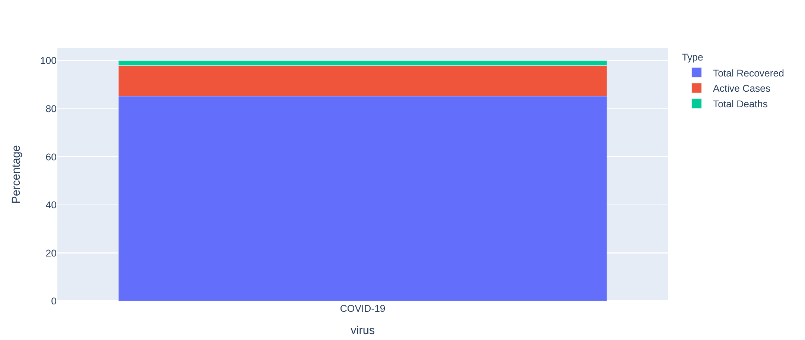
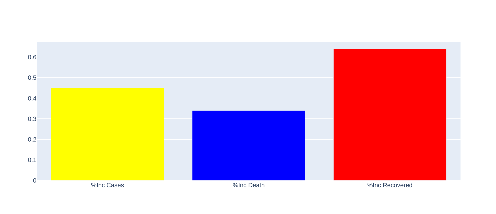
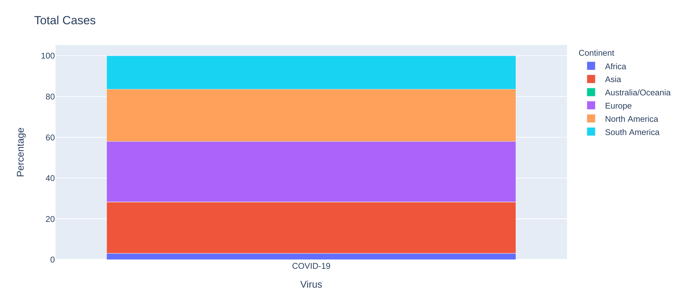
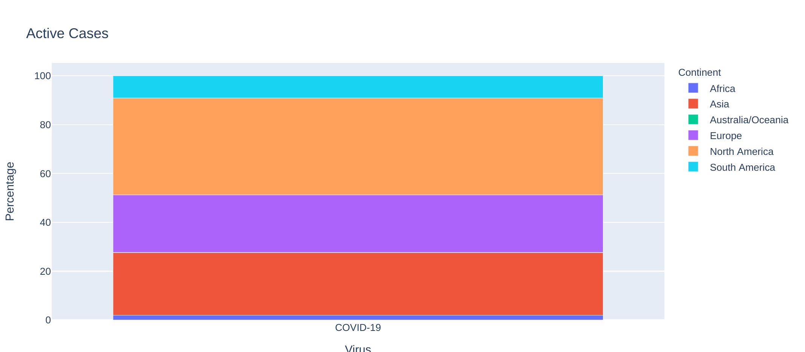
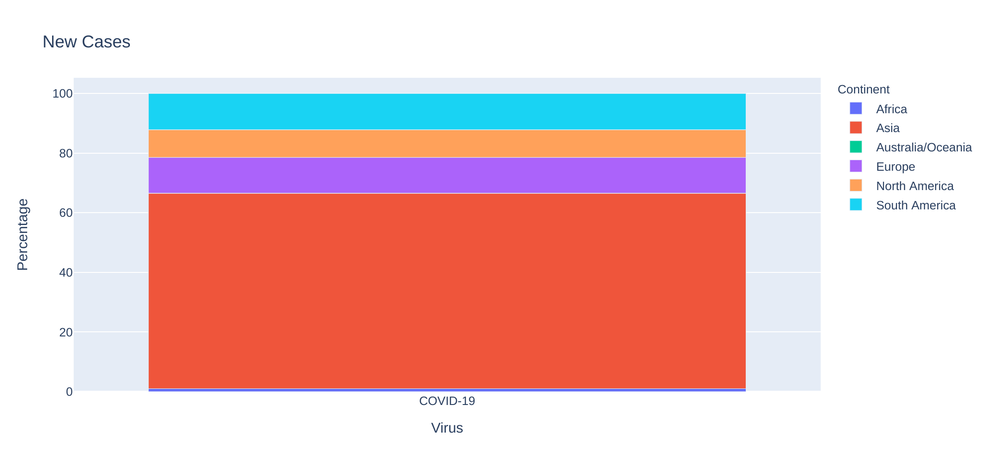
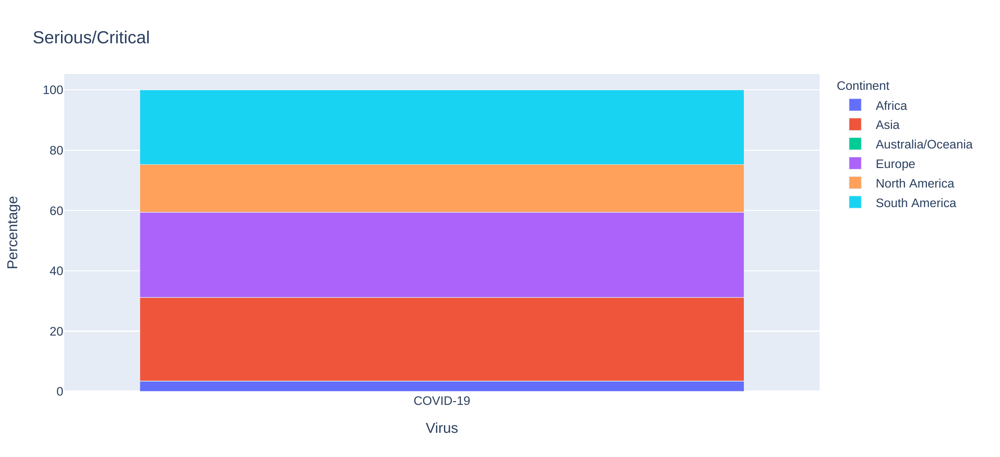
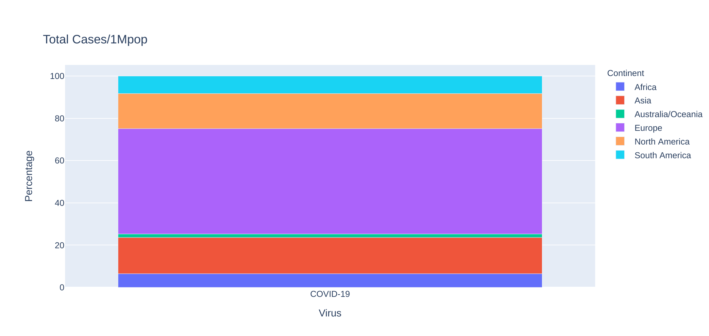
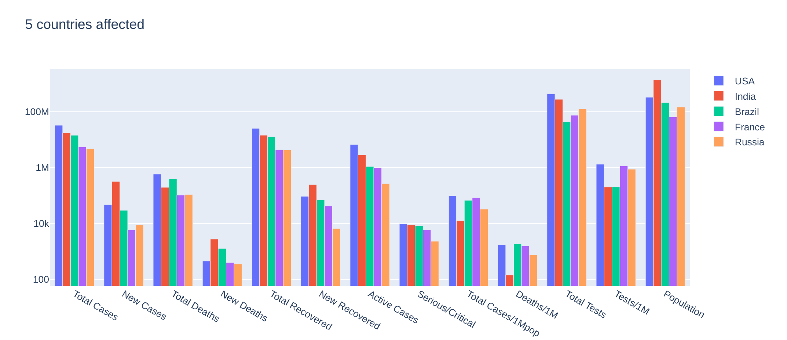

# COVID-19-Data-Analysis

1. [Importamos librerías ](#schema1)

# 1. Importamos librerías
~~~python
from bs4 import BeautifulSoup as sp
from datetime import date, datetime
from urllib.request import Request, urlopen
import pandas as pd
import numpy as np

import matplotlib.pyplot as plt
import plotly.graph_objects as go
import plotly.express as px
import plotly.offline as py
import seaborn as sns
import gc
import warnings
warnings.filterwarnings("ignore")
~~~

# 2. Web Scraping
~~~python
url = "https://www.worldometers.info/coronavirus/#countries"
req = Request(url, headers = {'User-Agent':'Chrome/39.0.2171.95' })
webpage= urlopen(req)
~~~

### Convertimos la respuesta a objeto Soup y lo obtenemos com una html

~~~python
page_soup = sp(webpage,'html.parser')
~~~
### Obtenemos el día de hoy
Con la función `datetime` para automatizar el día de hoy, para no tener que hacerlo manual cada vez que queramos usar este programa.
~~~python
today = datetime.now()
~~~
El día de ayer.
~~~python
yesterdar_str = "%s %d,%d" %(date.today().strftime("%b"), today.day-1,today.year)
~~~
### Obtenemos la tabla con id : main_table_countries_yesterday.
~~~python
table = page_soup.findAll("table", {"id":"main_table_countries_yesterday"})
containers = table[0].findAll("tr",{"style":""})
~~~

### Creamos función para limpiar los datos
~~~python
all_data = []
clean = True
for country in containers:
    country_data = []
    country_container = country.findAll('td')
    
    if country_container[1].text == "China":
        
        continue
    for i in range(1,len(country_container)):
        final_features = country_container[i].text
        if clean:
            
            if i !=1 and i != (len(country_container)-1):
                final_features = final_features.replace(",","")
                
                if final_features.find("+")!=-1:
                    final_features = final_features.replace("+","")
                    final_features = float(final_features)
                elif final_features.find("-")!=-1:
                    final_features = final_features.replace("-","")
                    final_features = float(final_features)
        if final_features == "N/A":
            final_features = 0
        elif final_features == "" or final_features== " ":
            final_features = -1

        country_data.append(final_features)
           
    all_data.append(country_data)
~~~
### Convertimos los datos a DataFrame
~~~python
df = pd.DataFrame(all_data)
~~~
### Le ponemos nombre a las columnas
~~~python
column_label = ["Country","Total Cases","New Cases","Total Deaths","New Deaths","Total Recovered","New Recovered","Active Cases", "Serious/Critical","Total Cases/1Mpop","Deaths/1M","Total Tests","Tests/1M","Population","Continent"]
df.columns = column_label
~~~
### Covertimos los valores númericos que estan como string a número
~~~python
for label in df.columns:
    if label != 'Country' and label != 'Continent':
        df[label]=pd.to_numeric(df[label])
~~~

### Insertamos los porcentajes
~~~python
df['%Inc Cases'] = df["New Cases"]/df["Total Cases"]*100
df['%Inc Death'] = df["New Deaths"]/df["Total Deaths"]*100
df['%Inc Recovered'] = df["New Recovered"]/df["Total Recovered"]*100
~~~
# 3. EDA: Exploratory data analysis
Probamos solo con el primer país.

~~~python
cases = df[['Total Recovered',"Active Cases", "Total Deaths"]].loc[0]
cases_df = pd.DataFrame(cases).reset_index()
cases_df.columns = ['Type', 'Total']
cases_df['Percentage'] = np.round(100*cases_df['Total']/np.sum(cases_df['Total']),2)
cases_df["virus"] = ["COVID-19" for i in range(len(cases_df))]
fig = px.bar(cases_df, x ="virus", y = "Percentage", color = "Type", hover_data = ["Total"])
fig.show()
~~~

# 4. Continent
~~~python
continent_df = df.groupby('Continent').sum().drop("All")
continent_df = continent_df.reset_index()
def continent_vis(v_list):
    for label in v_list:
        c_df = continent_df[["Continent",label]]
        c_df['Percentage'] = np.round(100*c_df[label]/np.sum(c_df[label]),2)
        c_df['Virus']= ["COVID-19" for i in range(len(c_df))]
        fig = px.bar(c_df, x ="Virus", y = "Percentage", color = "Continent", hover_data = [label])
        fig.update_layout(title = {"text":f"{label}"})
        fig.show()

case_list = ['Total Cases', 'Active Cases','New Cases',"Serious/Critical", "Total Cases/1Mpop"]
deaths_list  = ['Total Deaths','New Deaths', "Deaths/1M"]
recovered_list = ["Total Recovered", "New Recovered","%Inc Recovered"]
continent_vis(case_list)
~~~

# 5. Countries
~~~python
df = df.drop([len(df)-1])
country_df = df.drop([0])
LOOK_AT = 5
country = country_df.columns[1:14]
fig = go.Figure()
c = 0
for i in country_df.index:
    if c < LOOK_AT:
        fig.add_trace(go.Bar(name =country_df['Country'][i],x = country, y = country_df.loc[i][1:14] ))
    else:
        break
    c+=1
fig.update_layout(title = {"text": f'{LOOK_AT} countries affected'}, yaxis_type = 'log')
fig.show()
~~~

# Recursos
https://stackoverflow.com/questions/52771328/plotly-chart-not-showing-in-jupyter-notebook

https://www.youtube.com/watch?v=3ZacJ9zRVOU